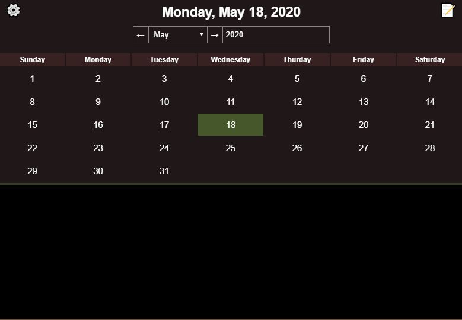

# domodel-diary-cordova

Cordova context for [domodel-diary](https://github.com/thoughtsunificator/domodel-diary)

- Calendar
- Daily notes encrypted using AES
- Password Protected

## Getting Started

### Prerequisites

- JDK 8
- Gradle

## Start (Android)

- ``npm start``

## Build (Android)

- ``npm run build``
